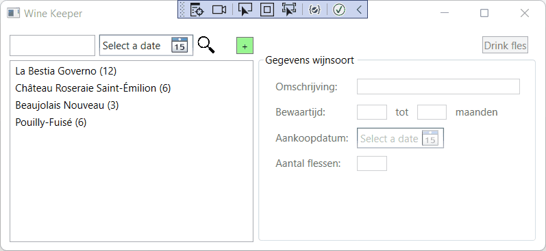
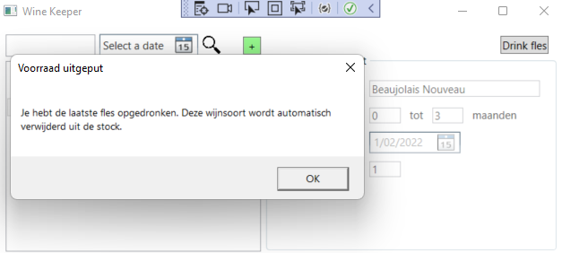

# PE1: Wine Keeper

In deze opdracht gaan we aan de slag met eigen klassen en objecten.
We maken een programma om je wijnvoorraad te beheren.
In het bijzonder willen we bijhouden hoe lang elke wijnsoort bewaard kan worden,
zodat we nooit een fles slecht laten worden maar ook nooit een fles bewaarwijn te snel openen (voor ze haar ideale smaak bereikt heeft).

Bekijk eerst onderstaande animatie van het eindresultaat.

## Functionaliteit

We overlopen eerst kort de functionaliteiten van het programma.

### Opstarten programma

Bij het opstarten van het programma is er al wat voorbeelddata automatisch aangemaakt.
Je mag je hiervoor baseren op de data uit de animatie, of zelf iets verzinnen.
De voorradige wijnsoorten worden in de lijst getoond, met vermelding van het aantal flessen.

### Detailgegevens wijnsoort

Door een wijnsoort aan te klikken, krijg je in het rechterpaneel de detailgegevens ervan te zien.
Deze zijn echter niet aanpasbaar.

### Fles drinken

Wanneer er een wijnsoort in de lijst geselecteerd is, wordt de knop "Drink fles" rechts bovenaan actief.
Hiermee kan je aangeven dat je een fles van deze wijn hebt opgedronken, m.a.w. het aantal resterende flessen verminderen met 1.

**Opgelet:** wanneer je de laatste fles opdrinkt, krijg je een melding te zien:

Vervolgens wordt deze wijnsoort automatisch verwijderd uit de stock.

### Wijnsoort toevoegen

Met het groene "+"-knopje kan je een nieuwe aankoop registeren.
Vul alle gegevens in met een geldige waarde, anders krijg je een foutmelding bij het bewaren.
Je kan eventueel ook de toevoeging annuleren.

**Opgelet:** zorg ervoor dat de aankoopdatum standaard ingevuld wordt op de huidige dag.

### Stock filteren

Je kan op twee manieren de stock filteren:
- Links bovenaan in het tekstvak boven de lijst kan je een zoekterm ingeven voor de omschrijving van de wijnsoort.
  **Opgelet:** deze werkt **hoofdletterongevoelig**. Als je "bes" intikt moet dus bv. "La Bestia Governo" ook in de resultaten verschijnen.
- Naast het tekstvak is een date picker waarmee je de lijst kan filteren volgens rijping van de wijn.
  Als je hier een datum invult, krijg je enkel de wijnsoorten te zien die op die datum drinkbaar zijn,
  rekening houdend met zowel de aankoopdatum als de minimale en maximale bewaartijd.

Je kan beide filters ook combineren.

**Tip!** Dit is het moeilijkste onderdeel van de opdracht.
We raden sterk aan om eerst de andere onderdelen uit te werken en pas naar de filter te kijken wanneer de rest klaar is.
Ook zonder de filter kan je slagen voor de opdracht (zie rubric op Leho) maar uiteraard met een lagere score.

## Technische informatie

De solution bevat reeds een WPF project met XAML code.
### WPF Project

De WPF layout is volledig voorzien maar mag je gerust verder uitbreiden.
De code behind moet je zelf nog implementeren, gebruik makend van de klassen in je class library.

### Class library

Maak in de bestaande solution een nieuw class library project aan met de naam `Prb.Wine.Keeper.Core`.
Hierin voorzie je de klassen die hieronder beschreven worden.
Zorg ervoor dat deze gebruikt kunnen worden vanuit de code behind van het WPF project.

#### WineBox

Stelt een doos wijn voor die onderdeel uitmaakt van je collectie.
Deze heeft enkele eigenschappen:
- `Description` (type `string`): de omschrijving van de wijnsoort. Deze mag niet leeg zijn en ook niet uit enkel witruimte bestaan. Indien wel, gooi je een exceptie met gepaste boodschap.
- `MinStorageMonths` (type `int`): het minimaal aantal maanden dat de wijn best bewaard moet worden. Mag niet kleiner zijn dan nul, indien wel pas je de waarde automatisch aan naar nul.
- `MaxStorageMonths` (type `int`): het maximaal aantal maanden dat de wijn bewaard kan worden. Mag niet kleiner zijn dan nul, indien wel pas je de waarde automatisch aan naar nul.
- `PurchaseDate` (type `DateTime`): de aankoopdatum van deze wijn.
- `NumberOfBottles` (type `int`): het aantal voorradige flessen van deze wijnsoort. Mag niet kleiner zijn dan nul, indien wel pas je de waarde automatisch aan naar nul. **Belangrijk:** zorg ervoor dat de waarde van deze eigenschap enkel kan aangepast worden vanuit de klasse `WineBox` zelf!
- `DrinkableFrom` (type `DateTime`, **read-only**): het vroegste moment waarop de wijn gedronken kan worden. Dit wordt afgeleid uit de aankoopdatum en minimale bewaartijd.
- `DrinkableUntil` (type `DateTime`, **read-only**): het laatste moment waarop de wijn gedronken kan worden. Dit wordt afgeleid uit de aankoopdatum en de maximale bewaartijd.

Voorzie een **constructor** die alle gegevens als parameters ontvangt (behalve de laatste twee, die automatisch afgeleid kunnen worden uit de andere eigenschappen). Zorg ervoor dat bij het aanmaken van een nieuwe `WineBox` het aantal flessen **minstens 1** is. Het kan later zakken naar nul wanneer we flessen opdrinken, maar bij aankoop verwachten we minstens 1 fles in de doos.

Een `WineBox` heeft ook enkele publieke methoden:
- `DrinkBottle()` (return type `bool`): vermindert het aantal flessen met 1. Geeft een `bool` terug:
  - `true` indien er nog flessen voorradig zijn.
  - `false` indien je zonet de laatste fles hebt opgedronken.
- `IsDrinkableAt(DateTime)` (return type `bool`): hiermee kan je opvragen of deze wijn drinkbaar is op een bepaalde datum. D.w.z. dat deze datum ligt tussen het vroegste en laatste moment waarop de wijn gedronken kan worden (zie eigenschappen hierboven).
- Voorzie een `ToString` override zodat de wijnsoorten getoond worden in de listbox zoals te zien in de animatie (beschrijving en aantal flessen).

#### WineCollection

Dit is een verzameling van `WineBox` objecten, met wat extra functionaliteit.
Een `WineCollection` heeft slechts één eigenschap:
- `WineBoxes` (type `List<WineBox>`, **read-only**): de lijst van voorradige wijnsoorten.

Hiernaast zijn er enkele methoden:
- `Add(WineBox)`: voegt wijn toe aan de collectie. Gooi een exceptie als je `null` ontvangt als argument.
- `Remove(WineBox)`: verwijdert wijn uit de collectie. Gooi een exceptie als je `null` ontvangt als argument.
- `Filter(string, DateTime?)` (return type `List<WineBox>`): deze methode is de meest complexe en wordt gebruikt voor het filteren van de collectie. Ze geeft het resultaat terug in de vorm van een gefilterde lijst van `WineBox` objecten, afgeleid uit de volledige collectie `WineBoxes`, die enkel de wijnsoorten bevat die **zowel**:
  - Een omschrijving hebben waarin de opgegeven zoekterm (`string`) voorkomt (**hoofdletterongevoelig**).
  - Drinkbaar zijn op het gegeven moment (`DateTime?`). Deze tweede parameter is nullable, voor het geval er geen datum ingevuld werd. In dat geval wordt er enkel op omschrijving gezocht.

Probeer de methode `Filter` zo compact mogelijk te schrijven, zonder codeduplicatie.

#### WineSeeder

Een kleine hulpklasse die wordt gebruikt om de initiële voorbeelddata te voorzien bij het opstarten van het programma.
Voorzie hier één enkele (statische) methode `Seed()` die een `WineCollection` teruggeeft met daarin de door jou gekozen voorbeelddata om mee te starten.
Gebruik deze vanuit de code behind bij het opstarten van de WPF applicatie.

### Tips

We werken in deze opdracht met het type `DateTime` om een datum voor te stellen.
Je kan hier enkele leuke dingen mee doen, bv.:
- Met de methode `AddMonths` maak je een nieuwe `DateTime` die een gegeven aantal maanden verder in de tijd ligt dan de `DateTime` waarop je de methode oproept. Bv. `DateTime nextMonth = myDate.AddMonths(1)`.
- Er zijn een aantal constructoren beschikbaar. Met `new DateTime(year, month, day)` maak je een `DateTime` aan die een gegeven datum voorstelt. Kan je gebruiken bij de seeding.
- De WPF date picker die we gebruiken geeft via `SelectedDate` de gekozen datum terug. **Let echter op:** de datum kan ook niet ingevuld zijn. Daarom is het type van `SelectedDate` **niet** `DateTime` maar **wel** `DateTime?` (de nullable variant). Je moet er dus rekening mee houden dat die `null` kan zijn. Indien niet `null`, kan je de feitelijke waarde opvragen via de eigenschap `Value` of door te casten naar `DateTime`.
